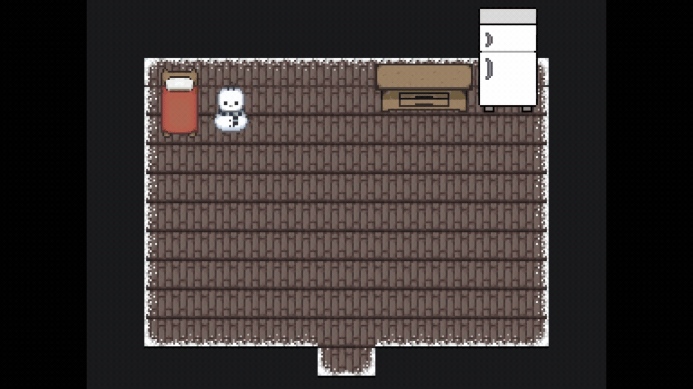
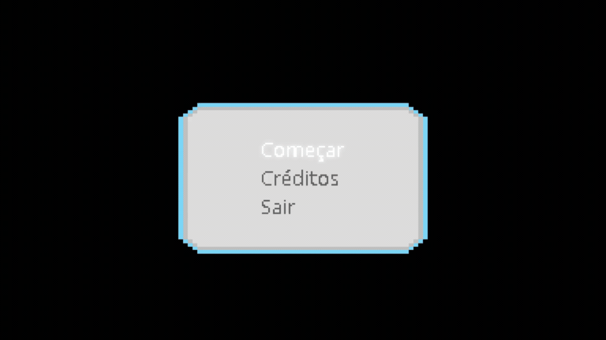
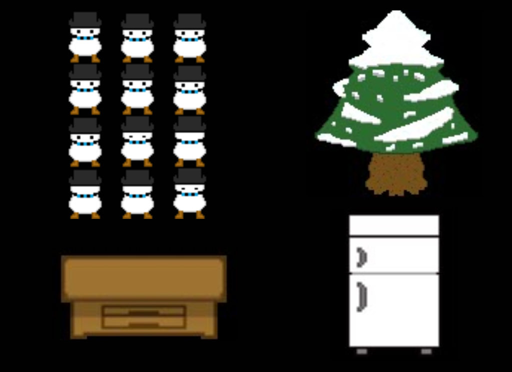

<h1>Pipipo the Snowman: The search for the perfect tan</h1>

This is a project I made while learning how to program in the Gamemaker Engine.     
You can move your character in two dimensions, leave and enter the igloo, and walk around the world.

 
 
 

I also created a menu system where you can choose to start the game (Começar), to see the credits (Créditos), and leave the game (Sair).    
When you start the game or open the credits, you need to press "Esc" to go back to the menu.

 
 
While doing this project, I asked for some friends of mine who knew how to draw for some pixel arts. But here are some pixel arts I drew.

